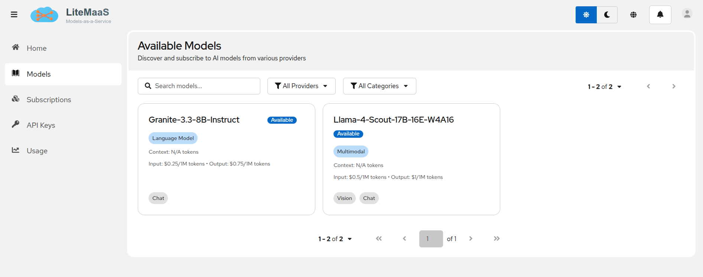
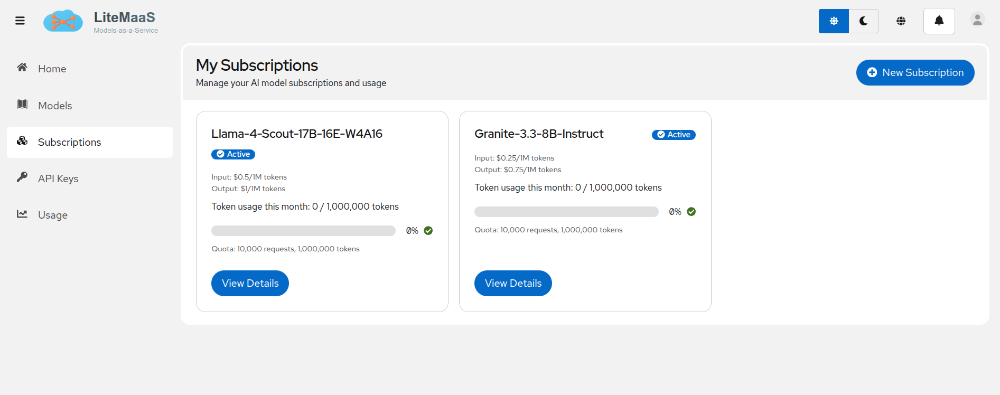
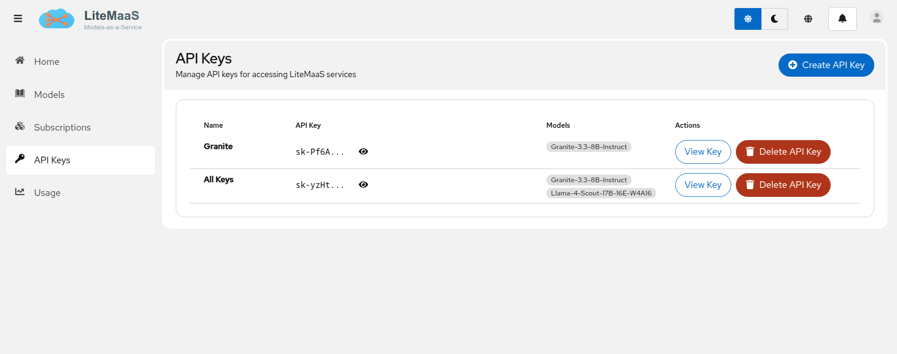
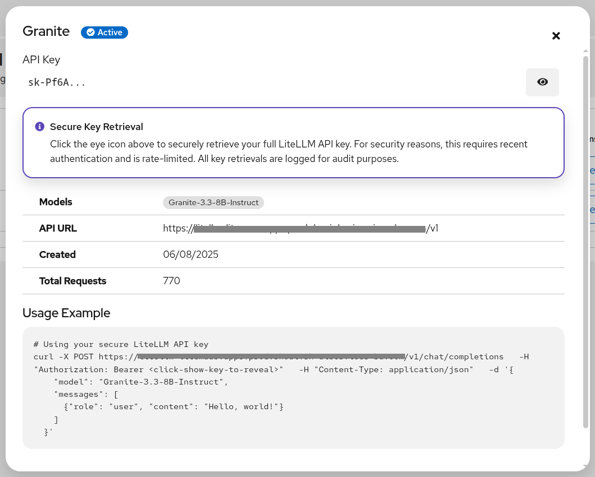
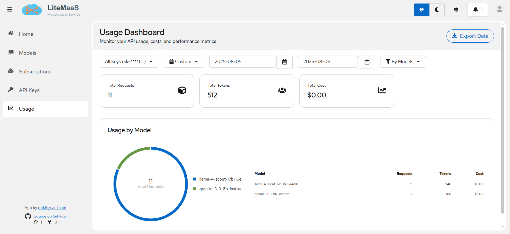

<!-- markdownlint-disable-next-line MD033 MD041 -->
<div align="center"> <!-- markdownlint-disable-next-line MD033 -->

</div>

# LiteMaaS - Models as a Service Platform

**LiteMaaS** is a proof-of-concept application for managing LLM subscriptions, API keys, and usage tracking. It seamlessly integrates with LiteLLM to provide a unified interface for accessing multiple LLMs with comprehensive budget management and team collaboration features.

## 🎟️ Key Benefits

- **Self-Service**: Users can independently manage subscriptions and API keys
- **Multi-Model Access**: One API key can access multiple models
- **Budget Control**: Set spending limits at user, team, and API key levels
- **Usage Analytics**: Real-time tracking of token usage and costs
- **Team Collaboration**: Share budgets and manage access across teams (upcoming feature)
- **Enterprise Security**: OAuth2 authentication with OpenShift support
- **Easy Deployment and Usage**: Automated deployment on OpenShift, Patternfly 6 UI

## 📸 Screenshots

### Model Discovery



### Subscriptions Management



### API Keys Management



### API Key Details



### Usage Statistics



## 🚀 Quick Start

```bash
# Install dependencies
npm install

# Start development servers (both backend and frontend)
npm run dev

# Backend only (http://localhost:8081)
npm run dev:backend

# Frontend only (http://localhost:3000)
npm run dev:frontend
```

## 📋 Prerequisites

- Node.js 18.x or 20.x
- PostgreSQL 12+
- npm 8+
- LiteLLM instance (optional, has mock fallback)

## 🏗️ Architecture

LiteMaaS is a **monorepo** using npm workspaces with two main packages:

- **Backend** (`@litemaas/backend`): High-performance Fastify API server with PostgreSQL
- **Frontend** (`@litemaas/frontend`): Modern React application with PatternFly 6 UI

## 🎯 System Architecture

```mermaid
graph TB
    subgraph "Frontend"
        UI[React + PatternFly 6]
    end

    subgraph "Backend Services"
        API[Fastify API Server]
        Auth[OAuth2/JWT Auth]
        DB[(PostgreSQL)]
    end

    subgraph "External Services"
        LiteLLM[LiteLLM Gateway]
        OAuth[OpenShift OAuth]
    end

    UI <--> API
    API <--> Auth
    API <--> DB
    API <--> LiteLLM
    Auth <--> OAuth

    style UI fill:#e3f2fd
    style API fill:#fff3e0
    style LiteLLM fill:#f3e5f5
```

## 🛠️ Development Setup

1. **Clone the repository**

   ```bash
   git clone https://github.com/rh-aiservices-bu/litemaas.git
   cd litemaas
   ```

2. **Set up environment variables**

   ```bash
   # Copy example environment files
   cp backend/.env.example backend/.env
   cp frontend/.env.example frontend/.env
   ```

3. **Configure your environment**
   - See [Configuration Guide](docs/deployment/configuration.md) for all available options
   - Minimum required: `DATABASE_URL`, `JWT_SECRET`, OAuth credentials

4. **Start PostgreSQL** (using Docker)

   ```bash
   docker compose -f dev-tools/compose.yaml up -d postgres
   ```

5. **Run the application**

   ```bash
   npm run dev
   ```

## 📚 Documentation

- [Architecture Overview](docs/architecture/overview.md)
- [API Reference](docs/api/README.md)
- [Configuration Guide](docs/deployment/configuration.md)
- [Development Guide](docs/development/setup.md)
- [Production Deployment](docs/deployment/production-guide.md)
- [UI Guidelines (PatternFly 6)](docs/development/pf6-guide/README.md)

### Quick Links

- 📝 [Project Roadmap](PROJECT_PLAN.md) - Development phases and milestones
- 🔧 [Contributing Guide](CONTRIBUTING.md) - How to contribute
- 🔐 [Security Policy](docs/deployment/authentication.md) - Authentication and security

## 🧪 Testing

```bash
# Run all tests
npm run test

# Backend tests
npm run test:backend

# Frontend tests
npm run test:frontend

# E2E tests
npm run test:e2e

# Performance tests
npm run test:perf
```

## 🚀 Deployment

LiteMaaS supports multiple deployment methods:

### OpenShift/Kubernetes Deployment (Recommended for Production)

Deploy to OpenShift or Kubernetes using the provided manifests and Kustomize configuration:

```bash
# Deploy to OpenShift
oc apply -k deployment/openshift/

# Access at:
# - LiteMaaS: https://litemaas-<namespace>.<cluster-domain>
# - LiteLLM UI: https://litellm-<namespace>.<cluster-domain>
```

**📚 Complete Guide**: [OpenShift Deployment Guide](docs/deployment/openshift-deployment.md)

### Container Deployment (Development/Testing)

Deploy using containers with Docker Compose for local development:

```bash
# Local deployment with containers
docker-compose up -d

# Or with Podman
podman-compose up -d
```

For detailed container deployment instructions, see [Container Deployment Guide](docs/deployment/containers.md).

### Manual Deployment

For traditional deployment instructions, see the [Production Guide](docs/deployment/production-guide.md).

### Quick Production Build

```bash
# Build both packages
npm run build

# Build output locations:
# - Backend: backend/dist/
# - Frontend: frontend/dist/
```

### Container Image Build

Build container images for deployment using the automated build script:

> **📦 Custom Registry**: To use a different container registry, edit the `REGISTRY` variable in `scripts/build-containers.sh` before building:
>
> ```bash
> # Change this line in scripts/build-containers.sh:
> REGISTRY="your-registry.com/your-org"
> ```

```bash
# Build both backend and frontend container images
npm run build:containers

# Build and push to registry (default: quay.io/rh-aiservices-bu)
npm run build:containers:push

# Push existing images to registry
npm run push:containers
```

**Features:**

- 🏷️ **Centralized versioning** - Uses version from root package.json
- 🐳 **Multi-runtime support** - Works with Docker or Podman
- 🚀 **Flexible workflow** - Separate build and push operations
- 🏗️ **Platform support** - Build for different architectures
- 🔧 **Registry flexibility** - Easy to configure for any container registry

**Script options:**

```bash
# Build without cache
./scripts/build-containers.sh --no-cache

# Build for ARM64
./scripts/build-containers.sh --platform linux/arm64

# Build with local tags only (no registry prefix)
./scripts/build-containers.sh --local
```

## 🤝 Contributing

We welcome contributions! Please see our [Contributing Guide](CONTRIBUTING.md) for details on:

- Code style and conventions
- Development workflow
- Submitting pull requests
- Reporting issues

## 📄 License

This project is licensed under the MIT License - see the [LICENSE](LICENSE) file for details.

## 🔗 Related Projects

- [LiteLLM](https://github.com/BerriAI/litellm) - The AI model proxy that LiteMaaS integrates with
- [PatternFly](https://www.patternfly.org/) - The UI framework used in the frontend

## 💬 Getting Help

- 📖 [Documentation](docs/) - Comprehensive guides and references
- 🐛 [Issue Tracker](https://github.com/rh-aiservices-bu/litemaas/issues) - Report bugs or request features
- 🤝 [Contributing](CONTRIBUTING.md) - Join the development community

---

Built with ❤️ by the [CAI Team](http://red.ht/cai-team)
